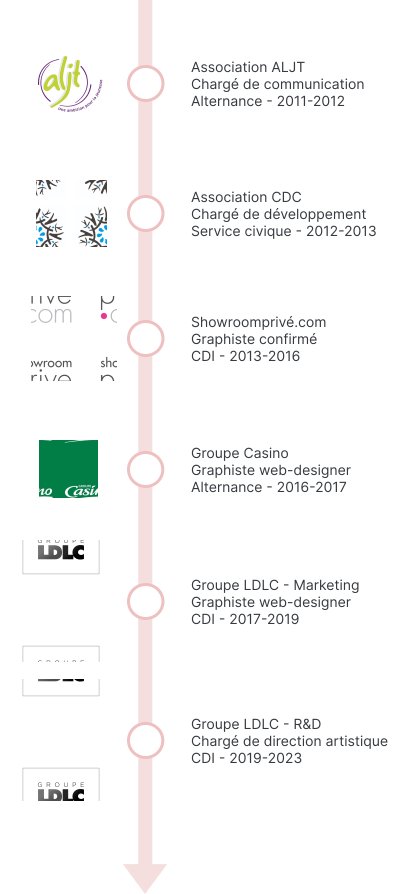

# index.html

```html
<!DOCTYPE html>
<html lang="fr">
<head>
    <meta charset="UTF-8">
    <meta name="viewport" content="width=device-width, initial-scale=1.0">
    <title>Pierre Lepage - Développeur Web & Designer</title>
    <link rel="stylesheet" href="https://cdnjs.cloudflare.com/ajax/libs/font-awesome/6.4.0/css/all.min.css" integrity="sha512-iecdLmaskl7CVkqkXNQ/ZH/XLlvWZOJyj7Yy7tcenmpD1ypASozpmT/E0iPtmFIB46ZmdtAc9eNBvH0H/ZpiBw==" crossorigin="anonymous" referrerpolicy="no-referrer" />
    <!-- Bootstrap CSS -->
    <link href="https://cdn.jsdelivr.net/npm/bootstrap@5.3.0-alpha1/dist/css/bootstrap.min.css" rel="stylesheet">
    <!-- Custom CSS -->
    <link href="https://fonts.googleapis.com/css2?family=Poppins:wght@300;400;600;700&display=swap" rel="stylesheet">
    <link rel="stylesheet" href="css/styles.css">
</head>
<body>
    <header>
        <nav class="navbar navbar-expand-lg navbar-dark sticky-top">
            <div class="container">
                <a class="navbar-brand d-flex align-items-center" href="#home">
                    <div class="logo-symbol me-2">LP</div>
                    <div class="logo-text">Lepage Pierre</div>
                </a>
                <button class="navbar-toggler" type="button" data-bs-toggle="collapse" data-bs-target="#navbarNav" aria-controls="navbarNav" aria-expanded="false" aria-label="Toggle navigation">
                    <span class="navbar-toggler-icon"></span>
                </button>
                <div class="collapse navbar-collapse" id="navbarNav">
                    <ul class="navbar-nav ms-auto align-items-center">
                        <li class="nav-item"><a class="nav-link" href="#home">Home</a></li>
                        <li class="nav-item"><a class="nav-link" href="#projects">Projects</a></li>
                        <li class="nav-item"><a class="nav-link" href="#about">About</a></li>
                        <li class="nav-item"><a class="nav-link" href="#contacts">Contacts</a></li>
                        <li class="nav-item">
                            <div class="social-icons d-flex align-items-center ms-lg-3">
                                <div class="vertical-line me-3"></div>
                                <a href="https://linkedin.com/in/yourprofile" target="_blank" class="nav-link">
                                    <i class="fab fa-linkedin fa-lg"></i>
                                </a>
                                <a href="https://github.com/yourusername" target="_blank" class="nav-link">
                                    <i class="fab fa-github fa-lg"></i>
                                </a>
                            </div>
                        </li>
                    </ul>
                </div>
            </div>
        </nav>
    </header>
    <main>
        <section class="hero">
            <div class="background parallax" data-speed="0.5"></div>
            <div class="container h-100">
                <div class="row h-100 align-items-center">
                    <div class="col-lg-6 text-content">
                        <div class="welcome-text">
                            <div class="dark">Hello, je suis</div>
                            <div class="light">Développeur</div>
                            <div class="highlight">web.</div>
                        </div>
                        <p class="mb-4"><br>Actuellement en formation développeur Full-stack,<br>je bénéficie de 10 ans d'expérience sur des missions<br>en tant que professionnel du design.</p>
                        <button class="btn cta-button">Contactez-moi</button>
                    </div>
                    <div class="col-lg-6 portrait-container">
                        <div class="portrait"></div>
                    </div>
                </div>
            </div>
        </section>
        <section class="white-section">   
            <div class="container-fluid p-0">
                <div class="experience-timeline desktop-only">
                    
                </div>
                <div class="frame-container mobile-only ">
                    
                </div>
            </div>
        </section>
        
    </section>
    <section id="about" class="py-5">
        <div class="container">
            <div class="title-container">
                <div class="title-icon"></div>
                <h2 class="title-text">Présentation</h2>
            </div>
            <p>Actuellement en formation pour devenir <span style="font-weight: bold;">développeur web</span>, je bénéficie de 10 ans d'expérience sur des missions en tant que professionnel du design.<br><br>

                Professionnel <span style="font-weight: bold;">polyvalent</span> avec une solide expérience en design et en gestion de projets, j’ai su <span style="font-weight: bold;">m’adapter et élargir mes compétences</span> vers le développement web. Expert dans l’analyse et la résolution de problèmes, je suis capable de proposer des solutions techniques tout en anticipant les impacts des modifications. <span style="font-weight: bold;">Autonome et réactif</span>, j’ai développé des compétences pour gérer les priorités et respecter les délais, même dans des situations d’urgence. Ma curiosité m’a conduit à évoluer vers un rôle en Recherche et Développement, où j’ai su m’intégrer rapidement.
                
                Ma communication efficace me permet de collaborer avec diverses personnalités. Mon <span style="font-weight: bold;">engagement</span> se concentre sur la <span style="font-weight: bold;">satisfaction des utilisateurs et des clients</span>, en privilégiant des solutions de qualité. La veille technologique et la recherche constante d’innovation sont des aspects clés de mon approche professionnelle.</p>
        </div>
    </section>
    
    <section id="skills" class="py-5">
        <div class="container">
            <h2 class="mb-4">Compétences</h2>
            <ul class="list-group">
                <li class="list-group-item">UX / UI Design</li>
                <li class="list-group-item">Développement web</li>
                <li class="list-group-item">HTML / CSS</li>
                <li class="list-group-item">JavaScript</li>
                <!-- Ajoutez d'autres compétences ici -->
            </ul>
        </div>
    </section>
    
    <section id="projects" class="py-5 bg-light">
        <div class="container">
            <h2 class="mb-4">Projets</h2>
            <div class="row">
                <!-- Exemple de projet -->
                <div class="col-md-4 mb-4">
                    <div class="card">
                        
                        <div class="card-body">
                            <h5 class="card-title">Nom du projet</h5>
                            <p class="card-text">Description courte du projet.</p>
                            <a href="#" class="btn btn-primary">Voir le projet</a>
                        </div>
                    </div>
                </div>
                <!-- Répétez pour chaque projet -->
            </div>
        </div>
    </section>
    
    <section id="experience" class="py-5">
        <div class="container">
            <h2 class="mb-4">Expérience professionnelle</h2>
            <div class="timeline">
                <!-- Exemple d'expérience -->
                <div class="card mb-3">
                    <div class="card-body">
                        <h5 class="card-title">Titre du poste</h5>
                        <h6 class="card-subtitle mb-2 text-muted">Nom de l'entreprise</h6>
                        <p class="card-text">Description des responsabilités et réalisations.</p>
                        <p class="card-text"><small class="text-muted">Période d'emploi</small></p>
                    </div>
                </div>
                <!-- Répétez pour chaque expérience -->
            </div>
        </div>
    </section>
    
    <section id="contact" class="py-5 bg-light">
        <div class="container">
            <h2 class="mb-4">Contactez-moi</h2>
            <form id="contact-form">
                <div class="mb-3">
                    <input type="text" class="form-control" name="name" placeholder="Nom" required>
                </div>
                <div class="mb-3">
                    <input type="email" class="form-control" name="email" placeholder="E-mail" required>
                </div>
                <div class="mb-3">
                    <input type="text" class="form-control" name="subject" placeholder="Objet" required>
                </div>
                <div class="mb-3">
                    <textarea class="form-control" name="message" rows="5" placeholder="Message" required></textarea>
                </div>
                <button type="submit" class="btn btn-primary">Envoyer</button>
            </form>
        </div>
    </section>
</main>

<footer class="bg-dark text-white text-center py-3">
    <p class="mb-0">&copy; 2024 Pierre Lepage. Tous droits réservés.</p>
</footer>

<!-- Bootstrap JS -->
<script src="https://cdn.jsdelivr.net/npm/bootstrap@5.3.0-alpha1/dist/js/bootstrap.bundle.min.js"></script>
<!-- Custom JS -->
<script src="js/main.js"></script>
</body>
</html>
```

# .gitignore

```
# Node modules
node_modules/

# Dossiers de build
dist/
build/

# Fichiers de logs
npm-debug.log*
yarn-debug.log*
yarn-error.log*

# Fichiers de configuration sensibles
.env
.env.local
.env.*.local

# Fichiers générés automatiquement
*.min.js
*.min.css
*.map

# Fichiers du système
.DS_Store
Thumbs.db

# Cache IDE
.vscode/
.idea/
*.swp

# Dépendances liées à l'éditeur de texte
*.sublime-project
*.sublime-workspace

# Dossiers et


```

# .aidigestignore

```

```

# js/main.js

```js
document.addEventListener('DOMContentLoaded', function() {
    // Smooth scrolling pour les liens de navigation
    document.querySelectorAll('a[href^="#"]').forEach(anchor => {
        anchor.addEventListener('click', function (e) {
            e.preventDefault();

            document.querySelector(this.getAttribute('href')).scrollIntoView({
                behavior: 'smooth'
            });
        });
    });

    // Gestion du formulaire de contact
    const form = document.getElementById('contact-form');
    form.addEventListener('submit', function(e) {
        e.preventDefault();
        // Ici, vous pouvez ajouter la logique pour envoyer le formulaire
        // Par exemple, en utilisant l'API Fetch pour envoyer les données à un serveur
        console.log('Formulaire soumis');
        form.reset();

        // Exemple d'utilisation d'une modale Bootstrap pour confirmer l'envoi
        var myModal = new bootstrap.Modal(document.getElementById('confirmationModal'), {});
        myModal.show();
    });
});

// Parallax

document.addEventListener('DOMContentLoaded', function() {
    const parallaxElements = document.querySelectorAll('.parallax');
    const initialOffset = window.innerHeight; // Hauteur initiale de la fenêtre

    window.addEventListener('load', function() {
        window.dispatchEvent(new Event('scroll'));
    });
    

    window.addEventListener('scroll', function() {
        let scrollPosition = window.pageYOffset;

        parallaxElements.forEach(element => {
            let speed = element.dataset.speed;
            // Ajustez la position en fonction de la hauteur initiale
            let yPos = (scrollPosition - initialOffset) * speed;
            element.style.transform = `translateY(${yPos}px)`;
        });
    });
});

//Chronologie

// Ajoutez ce code à votre fichier main.js ou créez un nouveau fichier JavaScript

document.addEventListener('DOMContentLoaded', function() {
    const frameContainer = document.querySelector('.frame-container');
    const frameImage = document.querySelector('.frame-image');

    function updateImagePosition() {
        if (window.innerWidth <= 991) {  // Vérifier si on est en mode mobile
            const containerRect = frameContainer.getBoundingClientRect();
            const containerHeight = containerRect.height;
            const viewportHeight = window.innerHeight;
            const scrollProgress = (containerRect.top * -1) / (containerHeight - viewportHeight);

            if (scrollProgress >= 0 && scrollProgress <= 1) {
                const translateY = scrollProgress * frameImage.offsetHeight;
                frameImage.style.transform = `translateY(-${translateY}px)`;
            }
        } else {
            // Réinitialiser la position de l'image en mode desktop
            frameImage.style.transform = 'translateY(0)';
        }
    }

    window.addEventListener('scroll', updateImagePosition);
    window.addEventListener('resize', updateImagePosition);

    // Appel initial pour positionner l'image correctement au chargement de la page
    updateImagePosition();
});
```

# images/portrait.png

This is a binary file of the type: Image

# images/portrait-fond.png

This is a binary file of the type: Image

# images/fond2.svg

This is a file of the type: SVG Image

# images/fond2.png

This is a binary file of the type: Image

# images/fond1.svg

This is a file of the type: SVG Image

# images/fond1.png

This is a binary file of the type: Image

# images/chrono2.svg

This is a file of the type: SVG Image

# images/chrono.svg

This is a file of the type: SVG Image

# images/Frame 17.png

This is a binary file of the type: Image

# css/styles.css

```css
/* Base styles */
body {
  font-family: 'Poppins', sans-serif;
  margin: 0;
  padding: 0;
  background-color: #1a1a1a;
  color: #ffffff;
}

.welcome-text {
  text-align: left;
  /* font-size: 64px; Taille de base pour les grands écrans */
  font-weight: bold;
  line-height: 1.2;
}
.light {
  color: #e0e0e0;
  font-size: 44px;
  line-height: 1.3;
}
.dark {
  color: #bab8b8;
  font-size: 24px;
}
.highlight {
  color: #ffb6b6;
  font-size: 132px;
  line-height: 0.7;
}
/* Typography */
h1 {
  font-size: 3.5rem;
  font-weight: 700;
  line-height: 1.2;
}

p {
  font-size: 1.2rem;
  font-weight: 300;
  line-height: 1.5;

}

.highlight {
  color: #ffb6b6;
}

/* Header and Navigation */
.navbar {
 
  background-color: #1a1a1a;
  border-bottom: 1px solid #333333;
}

.logo-symbol {
  border: 2px solid #ffffff;
  padding: 2px 5px;
  font-weight: bold;
  font-size: 1.2rem;
}

.logo-text {
  font-size: 1.2rem;
  font-weight: 300;
}

.navbar-dark .navbar-nav .nav-link {
  color: #ffffff;
}

.navbar-dark .navbar-nav .nav-link:hover {
  color: #cccccc;
}

.vertical-line {
  width: 1px;
  height: 20px;
  background-color: #EEC0C0;
}

.social-icons .nav-link i {
  color: #EEC0C0; 
  transition: color 0.3s ease;
  
}

.social-icons .nav-link:hover i {
  color: #cab0b0;
}

.title-container {
  display: flex;
  align-items: center;
  justify-content: center;
}
.title-icon {
  width: 0;
  height: 0;
  border-top: 10px solid transparent;
  border-bottom: 10px solid transparent;
  border-left: 15px solid #EEC0C0b4;
  margin-right: 10px;
  border-radius: 3px;
  margin-bottom: 5px;
}
.title-text {
  
  font-weight: bold;
  color: #fff;
  text-transform: uppercase;
}
/* Hero Section */
.hero {
  min-height: 85vh;
  position: relative;
  color: white;
  /* padding-bottom: 100px; */
}

.background {
  position: fixed;
  top: 0;
  left: 0;
  width: 100%;
  height: 100%;
  background-image: url('../images/fond1.svg');
  background-position: bottom; /* Changez 'top' en 'bottom' */
  background-size: cover;
  background-repeat: repeat;
  
  z-index: -1;
}
.text-content {
  z-index: 1;
  position: relative;
}

/* Portrait */
.portrait-container {
  position: relative;
  height: 100%;
  width: 100%;
}

.portrait {
  position: absolute;
  bottom: -385px;
  right: 0;
  width: 65%;
  height: calc(100% + 1000px);
  background-image: url('../images/portrait.png');
  background-size: contain;
  background-repeat: no-repeat;
  background-position: bottom right;
  z-index: 10;
}

/* CTA Button */
.cta-button {
  background-color: transparent;
  border: 2px solid white;
  color: white;
  padding: 0.75rem 1.5rem;
  font-size: 1rem;
  font-weight: 600;
  transition: all 0.3s ease;
}

.cta-button:hover {
  background-color: white;
  color: black;
}

/* Sections */
section {
  padding: 4rem 0;
}

.white-section {
  width: 100%;
  background-color: white;
  position: relative;
  z-index: 5;
  padding-top: 100px;
}

.desktop-only {
  display: block;
}

.mobile-only {
  display: none;
}

.white-section {
  overflow: hidden;
  position: relative;
}

.frame-container {
  width: 100%;
  height: 300vh; /* Trois fois la hauteur de la fenêtre pour permettre le défilement */
  position: relative;
}

.frame-image {
  width: 100%;
  height: auto;
  position: sticky;
  top: 0;
}


.experience-timeline {
  width: 100%;
  overflow-x: auto;
  margin-bottom: 2rem;
}

.experience-timeline img {
  max-width: 100%;
  height: auto;
}

/* Timeline */
.timeline .card {
  border-left: 4px solid #007bff;
  border-radius: 0;
  margin-bottom: 1.5rem;
}

/* Contact Form */
#contact-form {
  max-width: 500px;
  margin: 0 auto;
}

/* Footer */
footer {
  margin-top: 2rem;
}

/* Media Queries */
@media (max-width: 991px) {
  h1 {
    font-size: 2.5rem;
  }

  .vertical-line {
 display: none;
  }

  .social-icons .nav-link i {
    width: 20%;
    margin : 20px;
  }

  .hero {
    width: 100%;
    min-height: 65vh;
    padding-bottom: 50px;
  }

  .portrait-container {
    display: none; /* Hide portrait on smaller screens */
  }

  .white-section {
    padding-top: 0px; 
  }

  .social-icons {
    margin-top: 1rem;
  }

  .desktop-only {
    display: none;
}

.mobile-only {
    display: block;
}

.frame-container {
    height: 90vh; /* Ajustez selon vos besoins pour les appareils mobiles */
}
p {
  font-size: 0.8rem;
}
}

@media (min-width: 768px) {
  h1 {
    font-size: 4rem;
  }

  

  .experience-timeline img {
    width: auto;
    
}

}
```

