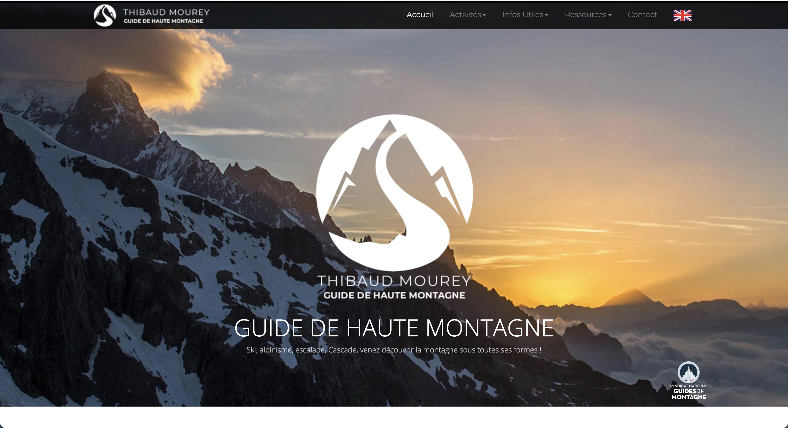
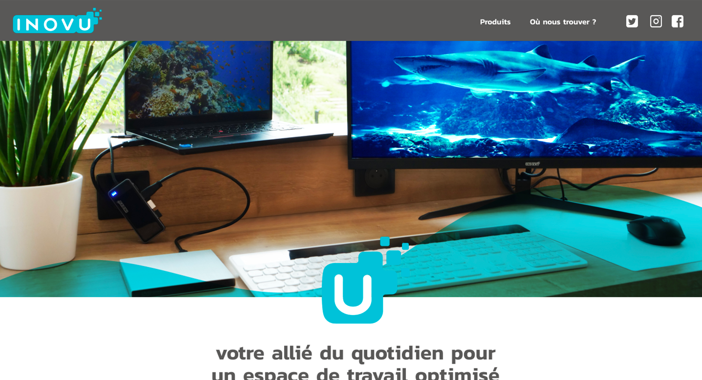
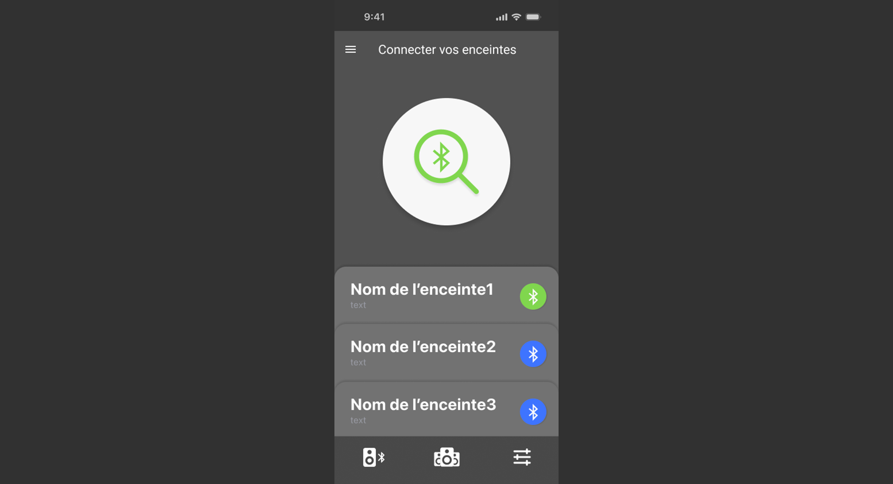
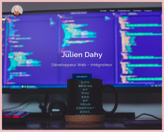

# index.html

```html
<!DOCTYPE html>
<html lang="fr">
<head>
    <meta charset="UTF-8">
    <meta name="viewport" content="width=device-width, initial-scale=1.0">
    <title>Pierre Lepage - Développeur Web & Designer</title>
    <link rel="stylesheet" href="https://cdnjs.cloudflare.com/ajax/libs/font-awesome/6.4.0/css/all.min.css" integrity="sha512-iecdLmaskl7CVkqkXNQ/ZH/XLlvWZOJyj7Yy7tcenmpD1ypASozpmT/E0iPtmFIB46ZmdtAc9eNBvH0H/ZpiBw==" crossorigin="anonymous" referrerpolicy="no-referrer" />
    <!-- Bootstrap CSS -->
    <link href="https://cdn.jsdelivr.net/npm/bootstrap@5.3.0-alpha1/dist/css/bootstrap.min.css" rel="stylesheet">
    <!-- Custom CSS -->
    <link href="https://fonts.googleapis.com/css2?family=Poppins:wght@300;400;600;700&display=swap" rel="stylesheet">
    <link rel="stylesheet" href="css/styles.css">
</head>
<body>
    <header>
        <nav class="navbar navbar-expand-lg navbar-dark fixed-top">
            <div class="container">
                <a class="navbar-brand d-flex align-items-center" href="#hero">
                    <div class="logo-symbol me-2">LP</div>
                    <div class="logo-text">Lepage Pierre</div>
                </a>
                <button class="navbar-toggler" type="button" data-bs-toggle="collapse" data-bs-target="#navbarNav" aria-controls="navbarNav" aria-expanded="false" aria-label="Toggle navigation">
                    <span class="navbar-toggler-icon"></span>
                </button>
                <div class="collapse navbar-collapse" id="navbarNav">
                    <ul class="navbar-nav ms-auto align-items-center">
                        <li class="nav-item"><a class="nav-link" href="#hero">Accueil</a></li>
                        <li class="nav-item"><a class="nav-link" href="#about">Présentation</a></li>
                        <li class="nav-item"><a class="nav-link" href="#projets">Projets</a></li>                  
                        <li class="nav-item"><a class="nav-link" href="#contact">Contact</a></li>
                        <li class="nav-item">
                            <div class="social-icons d-flex align-items-center ms-lg-3">
                                <div class="vertical-line me-3"></div>
                                <a href="https://www.linkedin.com/in/pierre-lepage-b00668ba/" target="_blank" class="nav-link">
                                    <i class="fab fa-linkedin fa-lg"></i>
                                </a>
                                <a href="https://github.com/Pierre-Lepage" target="_blank" class="nav-link">
                                    <i class="fab fa-github fa-lg"></i>
                                </a>
                            </div>
                        </li>
                    </ul>
                </div>
            </div>
        </nav>
    </header>
    <main>
        <section id="hero" class="hero" >
            <div class="background parallax" data-speed="0.5"></div>
            <div class="container h-100">
                <div class="row h-100 align-items-center">
                    <div class="col-lg-6 text-content">
                        <div class="welcome-text">
                            <div class="dark">Hello, je suis</div>
                            <div class="light">Développeur</div>
                            <div class="highlight">web.</div>
                        </div>
                        <p class="mb-4"><br>Actuellement en formation développeur Full-stack,<br>je bénéficie de 10 ans d'expérience sur des missions<br>en tant que professionnel du design.</p>
                        <a href="#contact">
                        <button class="btn cta-button">Contactez-moi</button>
                        </a>
                    </div>
                    <div class="col-lg-6 portrait-container">
                        <div class="portrait"></div>
                    </div>
                </div>
            </div>
        </section>
        <section class="white-section">   
            <div class="container-fluid p-0">
                <div class="experience-timeline desktop-only">
                    
                </div>
                <div class="frame-container mobile-only ">
                    
                </div>
            </div>
        </section>
        
    </section>
    <section id="about" class="py-5">
        <div class="container">
            <div class="title-container">
                <div class="title-icon"></div>
                <h2 class="title-text">Présentation</h2>
            </div>
            <p>Actuellement en formation pour devenir <span style="font-weight: bold;">développeur web</span>, je bénéficie de 10 ans d'expérience sur des missions en tant que professionnel du design.<br><br>

                Professionnel <span style="font-weight: bold;">polyvalent</span> avec une solide expérience en design et en gestion de projets, j’ai su <span style="font-weight: bold;">m’adapter et élargir mes compétences</span> vers le développement web. Expert dans l’analyse et la résolution de problèmes, je suis capable de proposer des solutions techniques tout en anticipant les impacts des modifications. <span style="font-weight: bold;">Autonome et réactif</span>, j’ai développé des compétences pour gérer les priorités et respecter les délais, même dans des situations d’urgence. Ma curiosité m’a conduit à évoluer vers un rôle en Recherche et Développement, où j’ai su m’intégrer rapidement.
                
                Ma communication efficace me permet de collaborer avec diverses personnalités. Mon <span style="font-weight: bold;">engagement</span> se concentre sur la <span style="font-weight: bold;">satisfaction des utilisateurs et des clients</span>, en privilégiant des solutions de qualité. La veille technologique et la recherche constante d’innovation sont des aspects clés de mon approche professionnelle.</p>
        </div>
    </section>
    <section id="competences" class="py-5">
        <div class="container">
            <div class="title-container">
                <div class="title-icon"></div>
                <h2 class="title-text">Compétences</h2>
            </div>
            <div class="competences-container">
                <div class="competences-icons">
                    
                    
                    
                    
                    
                    
                    
                    
                    
                    
                    
                    
                    
                    
                    
                </div>
                <div class="cv-preview">
                    <a href="./images/CV-PierreLepage.pdf" target="_blank" class="cv-link">
                        
                        <div class="cv-overlay">
                            <span>Voir le CV complet</span>
                        </div>
                    </a>
                </div>
            </div>
        </div>
    </section>
    
     <section id="projets" class="py-5">
        <div class="container">
            <div class="title-container">
                <div class="title-icon"></div>
                <h2 class="title-text">Projets</h2>
            </div>
            <div class="switch-container mb-4">
                <button class="switch-btn active" data-type="ux-ui">UX / UI</button>
                <button class="switch-btn" data-type="dev">Développement</button>
            </div>
            <div class="projects-carousel">
                <div class="projects-grid ux-ui-projects active">
                    <div class="project-item">
                        
                        <div class="project-info">
                            <h3>Maquette site nemeio</h3>
                            <a href="https://www.nemeio.com/" target="_blank" class="project-link">Voir le site</a>
                        </div>
                    </div>
                    <div class="project-item">
                        
                        <div class="project-info">
                            <h3>Maquette site solaari</h3>
                            <a href="https://www.solaari.com/fr/" target="_blank" class="project-link">Voir le site</a>
                        </div>
                    </div>
                    <div class="project-item">
                        
                        <div class="project-info">
                            <h3>maquette site guide</h3>
                            <a href="https://www.thibaud-guide.com/" target="_blank" class="project-link">Voir le site</a>
                        </div>
                    </div>
                    <div class="project-item">
                        
                        <div class="project-info">
                            <h3>maquette app solaari</h3>
                            <a href="https://play.google.com/store/apps/details?id=com.groupeldlc.solaari&hl=fr&pli=1" target="_blank" class="project-link">Voir l'app</a>
                        </div>
                    </div>
                    <div class="project-item">
                        
                        <div class="project-info">
                            <h3>Maquette logiciel nemeio</h3>
                            <!-- <a href="https://annei-site.com" target="_blank" class="project-link">Voir le site</a> -->
                        </div>
                    </div>
                        <div class="project-item">
                            
                            <div class="project-info">
                                <h3>maquette site foxSpirit</h3>
                                <a href="./images/projets/foxSpiritSite.pdf" target="_blank" class="project-link">Voir le PDF</a>
                            </div>
                        </div>
                        <div class="project-item">
                            
                            <div class="project-info">
                                <h3>maquette site inovu</h3>
                                <a href="./images/projets/inovuSite.pdf" target="_blank" class="project-link">Voir l'app</a>
                            </div>
                        </div>
                </div>
                <div class="projects-grid dev-projects">
                    <div class="project-item">
                        
                        <div class="project-info">
                            <h3>site de guide</h3>
                            <a href="https://www.thibaud-guide.com/" target="_blank" class="project-link">Voir le site</a>
                        </div>
                    </div>
                    <div class="project-item">
                        
                        <div class="project-info">
                            <h3>Projet iot bluejam</h3>
                            <a href="https://github.com/mmarzou/BlueJam" target="_blank" class="project-link">Voir le repo</a>
                        </div>
                    </div>
                    <!-- <div class="project-item">
                        
                        <div class="project-info">
                            <h3>Portfolio</h3>
                            <a href="https://votre-portfolio.com" target="_blank" class="project-link">Voir le site</a>
                        </div>
                    </div>
                    <div class="project-item">
                        
                        <div class="project-info">
                            <h3>Autre Projet</h3>
                            <a href="https://autre-projet.com" target="_blank" class="project-link">Voir le site</a>
                        </div>
                    </div> -->
                </div>
            </div>
            <div class="carousel-controls">
                <button class="prev-btn">&lt;</button>
                <button class="next-btn">&gt;</button>
            </div>
        </div>
    </section>
    
    <section id="contact" class="py-5">
        <div class="container">
            <div class="title-container">
                <div class="title-icon"></div>
                <h2 class="title-text">Contactez-moi</h2>
            </div>
            <form id="contact-form" action="https://formspree.io/f/mvgpedoe" method="POST">
                <div class="mb-3">
                    <label for="name" class="form-label">Nom</label>
                    <input type="text" class="form-control" id="name" name="name" placeholder="Votre nom" required>
                </div>
                <div class="mb-3">
                    <label for="email" class="form-label">E-mail</label>
                    <input type="email" class="form-control" id="email" name="email" placeholder="Votre e-mail" required>
                </div>
                <div class="mb-3">
                    <label for="subject" class="form-label">Objet</label>
                    <input type="text" class="form-control" id="subject" name="subject" placeholder="Objet du message" required>
                </div>
                <div class="mb-3">
                    <label for="message" class="form-label">Message</label>
                    <textarea class="form-control" id="message" name="message" rows="5" placeholder="Votre message" required></textarea>
                </div>
                <input type="text" name="_gotcha" style="display:none">
                <button type="submit" class="btn btn-primary">Envoyer</button>
                <input type="hidden" name="_next" value="https://pierre-lepage.github.io/portfolio/merci.html">
                <input type="hidden" name="_subject" value="Nouveau message depuis le portfolio">
            </form>
        </div>
    </section>
</main>

<footer class="bg-dark text-white text-center py-3">
    <p class="mb-0">&copy; 2024 Pierre Lepage. Tous droits réservés.</p>
</footer>

<!-- Bootstrap JS -->
<script src="https://cdn.jsdelivr.net/npm/bootstrap@5.3.0-alpha1/dist/js/bootstrap.bundle.min.js"></script>
<!-- Custom JS -->
<script src="js/main.js"></script>
</body>
</html>
```

# README.md

```md
# Portfolio - Pierre Lepage

Bienvenue sur mon portfolio en ligne, conçu pour présenter mes compétences et mon expérience en tant que développeur web et designer avec plus de 10 ans d'expérience dans le domaine.

## Aperçu
Ce portfolio met en avant mon parcours professionnel, mes projets réalisés et mes compétences en développement web et en design. La version actuelle est développée en HTML, CSS, JavaScript et utilise Bootstrap pour la mise en page responsive.

## Technologies utilisées
- **HTML5** : Pour la structure du site.
- **CSS3** (Bootstrap & Custom) : Mise en page responsive et animations personnalisées.
- **JavaScript** : Pour l'interactivité, les effets de scrolling et le formulaire de contact.
- **Bootstrap 5** : Pour le système de grille et les composants pré-stylisés.
- **Font Awesome** : Pour les icônes des liens sociaux.
- **Google Fonts** : Pour la typographie personnalisée.

## Fonctionnalités
- **Design responsive** : Adapté aux mobiles, tablettes et ordinateurs de bureau.
- **Parallax Scrolling** : Utilisé pour ajouter des effets de profondeur à la page d'accueil.
- **Section "Compétences"** : Liste mes compétences en design et en développement web.
- **Section "Projets"** : Présentation de mes projets réalisés, avec images et liens.
- **Section "Expérience professionnelle"** : Chronologie de mon parcours professionnel en tant que graphiste et développeur.
- **Formulaire de contact** : Formulaire fonctionnel pour permettre aux visiteurs de me contacter.
- **Animations** : Scrolling fluide, animations CSS et gestion des images en mode responsive.
- **Carrousel de projets** : Affichage des projets UX/UI et de développement avec navigation.

## Structure du projet
- `index.html` : Structure principale du site avec des sections pour l'accueil, les compétences, les projets, l'expérience professionnelle et le formulaire de contact.
- `css/styles.css` : Feuille de style personnalisée pour l'apparence du portfolio.
- `js/main.js` : Script JavaScript pour les effets de scrolling, les animations parallax, le carrousel de projets et la gestion du formulaire de contact.
- `images/` : Dossier contenant les images, les illustrations et les icônes utilisés dans le site.

## Installation
Pour exécuter ce projet en local, suivez les étapes ci-dessous :

1. **Cloner le dépôt :**
    \`\`\`bash
    git clone https://github.com/Pierre-Lepage/portfolio.git
    \`\`\`
2. **Naviguer dans le dossier du projet :**
    \`\`\`bash
    cd portfolio
    \`\`\`
3. **Ouvrir le fichier `index.html` dans un navigateur :**
    - Sur macOS : 
        \`\`\`bash
        open index.html
        \`\`\`
    - Sur Windows :
        \`\`\`bash
        start index.html
        \`\`\`
    - Sur Linux :
        \`\`\`bash
        xdg-open index.html
        \`\`\`

## Utilisation
- **Personnalisation des styles** : Les styles CSS sont dans `css/styles.css`. Ils peuvent être modifiés pour ajuster le design du portfolio.
- **Mise à jour du contenu** : La section "Projets" et "Expérience professionnelle" dans `index.html` peut être modifiée pour ajouter ou mettre à jour des informations.
- **Ajout de nouvelles images** : Les images des projets et de l'interface sont stockées dans le dossier `images/`. Assurez-vous d'utiliser des noms explicites pour les nouvelles images.

## Déploiement
Ce portfolio est actuellement déployé en utilisant GitHub Pages. Vous pouvez le voir en ligne à l'adresse : https://pierre-lepage.github.io/portfolio/

Pour déployer vos propres modifications :
1. Pousser les modifications sur la branche `main`.
2. GitHub Pages se mettra automatiquement à jour avec vos dernières modifications.

## Améliorations futures
- Migrer le site vers une version plus dynamique utilisant **React** et **Node.js**.
- Intégrer un backend pour gérer les soumissions du formulaire de contact.
- Ajouter des animations supplémentaires et une meilleure gestion des images avec **TailwindCSS**.

## Contact
Pour toute question ou proposition, n'hésitez pas à me contacter :
- **Email** : plepage@gmail.com
- **LinkedIn** : [Pierre Lepage](https://www.linkedin.com/in/pierre-lepage-b00668ba/)
- **GitHub** : [Pierre-Lepage](https://github.com/Pierre-Lepage)

---

© 2024 Pierre Lepage. Tous droits réservés.
```

# .gitignore

```
# Node modules
node_modules/

# Dossiers de build
dist/
build/

# Fichiers de logs
npm-debug.log*
yarn-debug.log*
yarn-error.log*

# Fichiers de configuration sensibles
.env
.env.local
.env.*.local

# Fichiers générés automatiquement
*.min.js
*.min.css
*.map

# Fichiers du système
.DS_Store
Thumbs.db

# Cache IDE
.vscode/
.idea/
*.swp

# Dépendances liées à l'éditeur de texte
*.sublime-project
*.sublime-workspace

# Dossiers et


```

# .aidigestignore

```

```

# js/main.js

```js
document.addEventListener('DOMContentLoaded', function() {
    // Smooth scrolling pour les liens de navigation
    document.querySelectorAll('a[href^="#"]').forEach(anchor => {
        anchor.addEventListener('click', function (e) {
            e.preventDefault();

            document.querySelector(this.getAttribute('href')).scrollIntoView({
                behavior: 'smooth'
            });
        });
    });

    // Gestion du formulaire de contact
    const form = document.getElementById('contact-form');
    form.addEventListener('submit', function(e) {
        e.preventDefault();
        // Ici, vous pouvez ajouter la logique pour envoyer le formulaire
        // Par exemple, en utilisant l'API Fetch pour envoyer les données à un serveur
        console.log('Formulaire soumis');
        form.reset();

        // Exemple d'utilisation d'une modale Bootstrap pour confirmer l'envoi
        var myModal = new bootstrap.Modal(document.getElementById('confirmationModal'), {});
        myModal.show();
    });
});

// Parallax

const background = document.querySelector('.background');
const initialOffset = 200; // Correspond à la valeur dans le CSS

window.addEventListener('scroll', function() {
    let scrollPosition = window.pageYOffset;
    let newPosition = 100 + initialOffset - (scrollPosition * 0.3);
    background.style.backgroundPositionY = `calc(100% + ${newPosition}px)`;
});

//Chronologie
document.addEventListener('DOMContentLoaded', function () {
    const frameContainer = document.querySelector('.frame-container');
    const frameImage = document.querySelector('.frame-image');
    let hasFadedIn = false;

    function handleScroll() {
        if (!hasFadedIn) {
            const containerRect = frameContainer.getBoundingClientRect();
            const viewportHeight = window.innerHeight;

            if (containerRect.top < viewportHeight) {
                frameImage.style.transition = 'opacity 1s ease-out';
                frameImage.style.opacity = 1;
                hasFadedIn = true;
            }
        }
    }

    frameImage.style.opacity = 0; // Cache l'image initialement
    window.addEventListener('scroll', handleScroll);
    handleScroll(); // Vérifier au chargement de la page
});

//carrousels projet

document.addEventListener('DOMContentLoaded', function() {
    const prevBtn = document.querySelector('.prev-btn');
    const nextBtn = document.querySelector('.next-btn');
    let currentSlide = 0;
    let slidesPerView = 3; // Par défaut, 3 projets visibles

    function updateSlide() {
        const activeGrid = document.querySelector('.projects-grid.active');
        const projects = activeGrid.querySelectorAll('.project-item');
        const screenWidth = window.innerWidth;

        // Ajuster le nombre de slides visibles en fonction de la taille de l'écran
        slidesPerView = screenWidth < 992 ? 2 : 3;

        // Cacher tous les éléments
        projects.forEach((project) => {
            project.style.display = 'none';
        });

        // Afficher les éléments selon 'currentSlide' et 'slidesPerView'
        for (let i = currentSlide; i < currentSlide + slidesPerView && i < projects.length; i++) {
            projects[i].style.display = 'block';
        }
    }

    prevBtn.addEventListener('click', () => {
        currentSlide = Math.max(currentSlide - slidesPerView, 0);
        updateSlide();
    });

    nextBtn.addEventListener('click', () => {
        const activeGrid = document.querySelector('.projects-grid.active');
        const projectsCount = activeGrid.querySelectorAll('.project-item').length;
        currentSlide = Math.min(currentSlide + slidesPerView, projectsCount - slidesPerView);
        updateSlide();
    });

    // Événement pour basculer entre les sections "UX / UI" et "Développement"
    const switchButtons = document.querySelectorAll('.switch-btn');
    switchButtons.forEach(button => {
        button.addEventListener('click', (e) => {
            switchButtons.forEach(btn => btn.classList.remove('active'));
            e.target.classList.add('active');

            const type = e.target.getAttribute('data-type');
            document.querySelectorAll('.projects-grid').forEach(grid => {
                grid.classList.remove('active');
            });
            document.querySelector(`.${type}-projects`).classList.add('active');

            // Réinitialiser le carrousel pour la nouvelle section
            currentSlide = 0;
            updateSlide();
        });
    });

    // Initialiser l'affichage des slides
    window.addEventListener('resize', updateSlide);
    updateSlide();
});

// Formulaire

var form = document.getElementById("contact-form");
    
async function handleSubmit(event) {
  event.preventDefault();
  var status = document.createElement("div");
  status.style.marginTop = "1rem";
  form.appendChild(status);
  var data = new FormData(event.target);
  fetch(event.target.action, {
    method: form.method,
    body: data,
    headers: {
        'Accept': 'application/json'
    }
  }).then(response => {
    if (response.ok) {
      status.innerHTML = "Message envoyé avec succès !";
      form.reset()
    } else {
      response.json().then(data => {
        if (Object.hasOwn(data, 'errors')) {
          status.innerHTML = data["errors"].map(error => error["message"]).join(", ")
        } else {
          status.innerHTML = "Oops! Une erreur est survenue lors de l'envoi du formulaire"
        }
      })
    }
  }).catch(error => {
    status.innerHTML = "Oops! Une erreur est survenue lors de l'envoi du formulaire"
  });
}
form.addEventListener("submit", handleSubmit)
```

# images/portrait2.png

This is a binary file of the type: Image

# images/portrait.png

This is a binary file of the type: Image

# images/portrait-fond.psd

This is a binary file of the type: Binary

# images/portrait-fond.png

This is a binary file of the type: Image

# images/inovuSite.pdf

This is a binary file of the type: PDF

# images/foxSpiritSite.pdf

This is a binary file of the type: PDF

# images/fond2.svg

This is a file of the type: SVG Image

# images/fond2.png

This is a binary file of the type: Image

# images/fond1.svg

This is a file of the type: SVG Image

# images/fond1.png

This is a binary file of the type: Image

# images/chrono2.svg

This is a file of the type: SVG Image

# images/chrono.svg

This is a file of the type: SVG Image

# images/Frame 17.png

This is a binary file of the type: Image

# images/CV-PierreLepage.pdf

This is a binary file of the type: PDF

# images/CV-PierreLepage.jpg

This is a binary file of the type: Image

# css/styles.css

```css
/* Base styles */
body {
  font-family: 'Poppins', sans-serif;
  margin: 0;
  padding: 0;
  background-color: #1a1a1a;
  color: #ffffff;
  padding-top: 70px; /* Ajustez la valeur selon la hauteur de votre navbar */
  
}

.welcome-text {
  text-align: left;
  /* font-size: 64px; Taille de base pour les grands écrans */
  font-weight: bold;
  line-height: 1.2;
}
.light {
  color: #e0e0e0;
  font-size: 44px;
  line-height: 1.3;
}
.dark {
  color: #bab8b8;
  font-size: 24px;
}
.highlight {
  color: #ffb6b6;
  font-size: 132px;
  line-height: 0.7;
}
/* Typography */
h1 {
  font-size: 3.5rem;
  font-weight: 700;
  line-height: 1.2;
}

p {
  font-size: 1.2rem;
  font-weight: 300;
  line-height: 1.5;

}

.highlight {
  color: #ffb6b6;
}

/* Header and Navigation */
.navbar {
 
  background-color: #1a1a1a;
  border-bottom: 1px solid #333333;
}

.logo-symbol {
  border: 2px solid #ffffff;
  padding: 2px 5px;
  font-weight: bold;
  font-size: 1.2rem;
}

.logo-text {
  font-size: 1.2rem;
  font-weight: 300;
}

.navbar-dark .navbar-nav .nav-link {
  color: #ffffff;
}

.navbar-dark .navbar-nav .nav-link:hover {
  color: #cccccc;
}

.vertical-line {
  width: 1px;
  height: 20px;
  background-color: #EEC0C0;
}

.social-icons .nav-link i {
  color: #EEC0C0; 
  transition: color 0.3s ease;
  
}

.social-icons .nav-link:hover i {
  color: #cab0b0;
}

.title-container {
  display: flex;
  align-items: center;
  justify-content: center;
}
.title-icon {
  width: 0;
  height: 0;
  border-top: 10px solid transparent;
  border-bottom: 10px solid transparent;
  border-left: 15px solid #EEC0C0b4;
  margin-right: 10px;
  border-radius: 3px;
  margin-bottom: 8px;
}
.title-text {
  
  font-weight: bold;
  color: #fff;
  text-transform: uppercase;
}
/* Hero Section */
.hero {
  min-height: 85vh;
  position: relative;
  color: white;
  /* padding-bottom: 100px; */
}

.background {
  position: fixed;
  top: 0;
  left: 0;
  width: 100%;
  height: 100%;
  background-image: url('../images/fond1.svg');
  background-position: center calc(100% + 200px); /* Ajusté pour commencer un peu plus haut */
  background-size: cover; /* Changé pour couvrir toute la zone */
  background-repeat: no-repeat;
  z-index: -1;
}
.text-content {
  z-index: 1;
  position: relative;
}

/* Portrait */
.portrait-container {
  position: relative;
  height: 100%;
  width: 100%;
}

.portrait {
  position: absolute;
  bottom: -385px;
  right: 0;
  width: 65%;
  height: calc(100% + 1000px);
  background-image: url('../images/portrait.png');
  background-size: contain;
  background-repeat: no-repeat;
  background-position: bottom right;
  z-index: 10;
}

/* CTA Button */
.cta-button {
  background-color: transparent;
  border: 2px solid white;
  color: white;
  padding: 0.75rem 1.5rem;
  font-size: 1rem;
  font-weight: 600;
  transition: all 0.3s ease;
}

.cta-button:hover {
  background-color: white;
  color: black;
}

/* Sections */
section {
  padding: 4rem 0;
}

.white-section {
  width: 100%;
  background-color: white;
  position: relative;
  z-index: 5;
  padding-top: 100px;
  overflow: hidden;
  position: relative;
}

.desktop-only {
  display: block;
}

.mobile-only {
  display: none;
}


.frame-container {
  width: 100%;
  height: 300vh; /* Trois fois la hauteur de la fenêtre pour permettre le défilement */
  position: relative;
}

.frame-image {
  width: 100%;
  height: auto;
  position: sticky;
  top: 0;
}


.experience-timeline {
  width: 100%;
  overflow-x: auto;
  margin-bottom: 2rem;
}

.experience-timeline img {
  max-width: 100%;
  height: auto;
}


.timeline .card {
  border-left: 4px solid #007bff;
  border-radius: 0;
  margin-bottom: 1.5rem;
}

#competences {
  max-width: 1200px;
  background-color: #f8d7da;
  padding: 40px 60px;
  border-radius: 20px;
  margin: 0 auto;
  margin-bottom: 50px;
}


.competences-container {
  display: flex;
  justify-content: space-between;
  align-items: flex-start;
}

.competences-icons {
  display: grid;
  grid-template-columns: repeat(5, 1fr);
  column-gap: 15px; /* Espacement horizontal réduit entre les icônes */
  row-gap: 30px; /* Maintien de l'espacement vertical */
  width: 65%;
  margin-top: 100px;
}

.competence-icon {
  width: 40px; /* Réduction légère de la taille des icônes */
  height: 40px;
  object-fit: contain;
  justify-self: center;
}

.cv-preview {
  width: 30%;
  position: relative;
}

.cv-link {
  display: block;
  position: relative;
  overflow: hidden;
  border-radius: 10px;
  box-shadow: 0 5px 15px rgba(0,0,0,0.1);
}

.cv-link img {
  width: 100%;
  display: block;
  transition: transform 0.3s ease;
}

.cv-overlay {
  position: absolute;
  top: 0;
  left: 0;
  right: 0;
  bottom: 0;
  background: rgba(0,0,0,0.7);
  display: flex;
  align-items: center;
  justify-content: center;
  opacity: 0;
  transition: opacity 0.3s ease;
}

.cv-overlay span {
  color: #ffffff;
  font-size: 1rem;
  text-align: center;
  padding: 10px;
}

.cv-link:hover img {
  transform: scale(1.05);
}

.cv-link:hover .cv-overlay {
  opacity: 1;
}

#projets {
 
  padding: 60px 0;
}

.switch-container {
  display: flex;
  justify-content: center;
  background-color: #e9ecef;
  border-radius: 25px;
  padding: 5px;
  width: fit-content;
  margin: 0 auto 30px;
}

.switch-btn {
  padding: 5px 15px;
  border: none;
  background-color: transparent;
  cursor: pointer;
  border-radius: 20px;
  transition: background-color 0.3s, color 0.3s;
  color: #333;
}

.switch-btn.active {
  background-color: #f8d7da; /* Couleur rose clair */
  color: #333;
}

.projects-carousel {
  position: relative;
  overflow: hidden;
}

.projects-grid {
  display: none;
  grid-template-columns: repeat(3, 1fr);
  gap: 10px;
  opacity: 0;
  transform: translateY(20px);
  transition: opacity 0.5s ease-in-out, transform 0.5s ease-in-out;
}

.projects-grid.active {
  display: grid;
  opacity: 1;
  transform: translateY(0);
}

.project-item {
  position: relative;
  border-radius: 10px;
  overflow: hidden;
  box-shadow: 0 4px 6px rgba(0,0,0,0.1);
  border: 3px solid #f8d7da;
}

.project-item img {
  width: 100%;
  height: auto;
  display: block;
}

.project-info {
  position: absolute;
  bottom: 0;
  left: 0;
  right: 0;
  background-color: rgba(0,0,0,0.7);
  color: white;
  padding: 15px;
  transform: translateY(100%);
  transition: transform 0.3s;
}

.project-item:hover .project-info {
  transform: translateY(0);
}

.project-info h3 {
  margin: 0 0 10px;
}

.project-link {
  color: #fff;
  text-decoration: none;
  font-weight: bold;
}

.carousel-controls {
  display: flex;
  justify-content: center;
  margin-top: 20px;
}

.prev-btn, .next-btn {
  background-color: #f8d7da; /* Couleur rose clair */
  color: #333;
  border: none;
  padding: 10px 15px;
  margin: 0 10px;
  cursor: pointer;
  border-radius: 5px;
}


/* Contact Form */

#contact {
  background-color: #f8d7da;
}

#contact-form {
  max-width: 500px;
  margin: 0 auto;
}

/* Footer */
footer {
  /* margin-top: 2rem; */
}

/* Media Queries */
@media (max-width: 991px) {
  h1 {
    font-size: 2.5rem;
  }

  .vertical-line {
 display: none;
  }

  .social-icons .nav-link i {
    width: 20%;
    margin : 20px;
  }

  .hero {
    width: 100%;
    min-height: 65vh;
    padding-bottom: 50px;
  }

  .portrait-container {
    display: none; /* Hide portrait on smaller screens */
  }

  .white-section {
    padding-top: 0px; 
  }

  .social-icons {
    margin-top: 1rem;
  }

  .desktop-only {
    display: none;
}

.mobile-only {
    display: block;
}

.frame-container {
    height: 100%; /* Ajustez selon vos besoins pour les appareils mobiles */
}
p {
  font-size: 0.8rem;
}

#competences {
  width: 100%;
  margin-bottom: 30px;
}

.competences-container {
  flex-direction: column;
  align-items: center;
}

.competences-icons {
  width: 100%;
  margin-bottom: 30px;
  margin-top: auto;
}

.cv-preview {
  width: 70%;
}
.projects-grid {
  grid-template-columns: repeat(2, 1fr); /* Deux colonnes pour les écrans de moins de 992px */
}
}

/* @media (min-width: 768px) {
  h1 {
    font-size: 4rem;
  }

  

  .experience-timeline img {
    width: auto;
    
}
.competences-icons {
  grid-template-columns: repeat(3, 1fr);
}

} */
```

# images/projets/thibaudGuide.png

This is a binary file of the type: Image

# images/projets/solaariApp.png

This is a binary file of the type: Image

# images/projets/projet3.png

This is a binary file of the type: Image

# images/projets/projet2.png

This is a binary file of the type: Image

# images/projets/projet1.png

This is a binary file of the type: Image

# images/projets/portrait2.png

This is a binary file of the type: Image

# images/projets/nemeioLogiciel.png

This is a binary file of the type: Image

# images/projets/nemeio.png

This is a binary file of the type: Image

# images/projets/foxSpiritSite.png

This is a binary file of the type: Image

# images/projets/bluejamApp.png

This is a binary file of the type: Image

# images/projets/Solaari.png

This is a binary file of the type: Image

# images/projets/InovuSite.png

This is a binary file of the type: Image

# images/icons/vscode-icon.svg

This is a file of the type: SVG Image

# images/icons/react-icon.svg

This is a file of the type: SVG Image

# images/icons/php-icon.svg

This is a file of the type: SVG Image

# images/icons/photoshop-icon.svg

This is a file of the type: SVG Image

# images/icons/nodejs-icon.svg

This is a file of the type: SVG Image

# images/icons/mysql-icon.svg

This is a file of the type: SVG Image

# images/icons/mongodb-icon.svg

This is a file of the type: SVG Image

# images/icons/js-icon.svg

This is a file of the type: SVG Image

# images/icons/indesign-icon.svg

This is a file of the type: SVG Image

# images/icons/illustrator-icon.svg

This is a file of the type: SVG Image

# images/icons/html5-icon.svg

This is a file of the type: SVG Image

# images/icons/github-icon.svg

This is a file of the type: SVG Image

# images/icons/figma-icon.svg

This is a file of the type: SVG Image

# images/icons/css3-icon.svg

This is a file of the type: SVG Image

# images/icons/bootstrap-icon.svg

This is a file of the type: SVG Image

